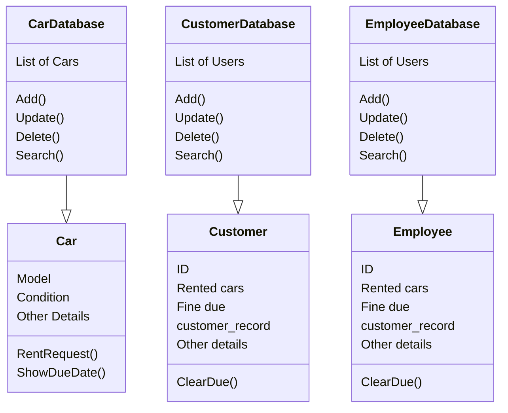
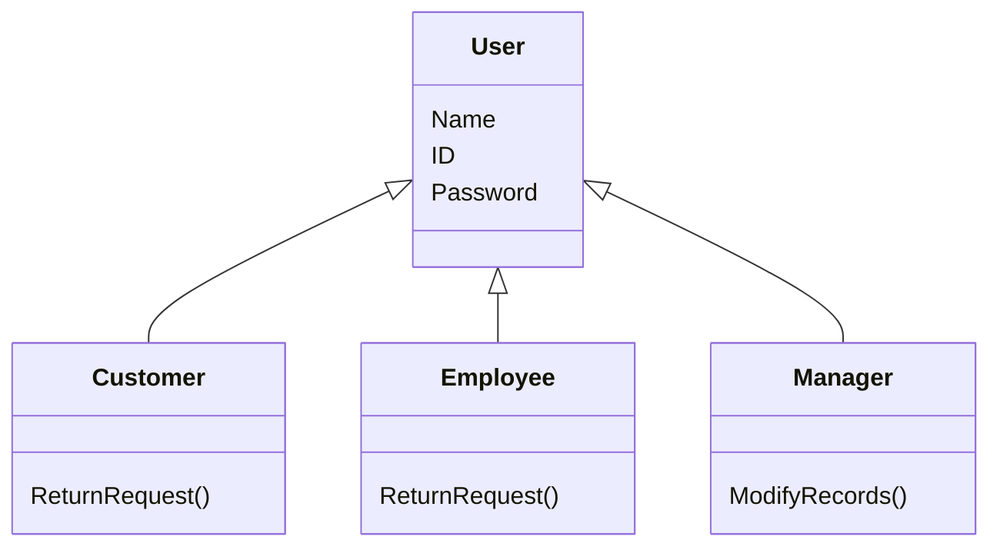

<strong><h1>Assignment 1: Car Rental System in C++</h1></strong>

<h3>CS253 – 2024, IIT Kanpur</h3>

You are required to implement a car rental system in C++ language using **Object-Oriented Programming concepts**. Implement the system on command line interface.

List of basic functionalities:
1. Keep records of cars rented per customer/employee.
2. A customer is given a car if his/her `customer_record` is good enough. A `customer_record` is updated based on several factors:

    a. Car returned later than `return_date`.

    b. Damage caused to the car. The condition in which the car has been returned.

    c. The same will be for employees i.e. employee_record.
3. Maintain different databases for customers, employees, and cars.
4. Maintain three different classes for customers, employees, and manager.

    a. A **customer** can see all the available cars. Can browse all the cars he is currently renting. Can rent a limited number of cars as per his/her `customer_record`. (Optional: If a customer is new, register him with an average `customer_record` value). A fine will be imposed per day from the day of return.

    b. An **employee** can see all the available cars. Can browse all the cars he/she is currently renting. Can rent a limited number of cars as per his/her employee_record. They are given a 15% discount on all cars. A fine will be imposed per day from the day of return.

    c. A **manager** can add/update/delete any customer or employee. Can also update/delete/add cars in the store. Can see all the cars and who they are rented to.

5. Every method must be present in its appropriate class. Try to make use of both the private and public functionalities for attributes. Prudently use inheritance, polymorphism, data abstraction, and other concepts of OOPs. Start with atleast 5 cars, 5 customers, 5 employees and 1 manager. Feel free to choose **default value(s)** for other parameters.

6. For reference, you can check out the block diagram given on the next page.

Your project will be tested on edge cases (for example, one cannot rent if there is no car available) and overall, how complex as well as efficient your code is. *Be careful of plagiarism, if found, will be treated severely.* 

***Note:*** You can use File Handling through C++ [[1]](https://www.geeksforgeeks.org/file-handling-c-classes/). Or can use local databases like MySQL [[2]](https://www.geeksforgeeks.org/how-to-setup-mysql-database-in-visual-studio-2022-for-a-cpp-application/), MongoDB [[3]](https://www.mongodb.com/developer/products/mongodb/getting-started-mongodb-cpp/) *(relatively easy)*, etc. Although, you will not be judged based on your DB management skills rather your
implementation and understanding of <ins>concepts of OOPs</ins>.

Figure 1 : All the databases

Figure 2: List of customers and employees

